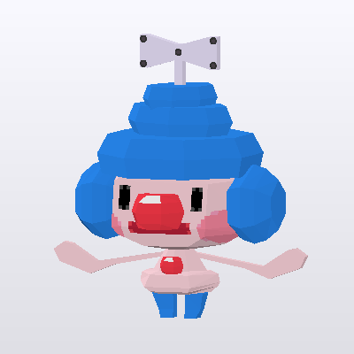
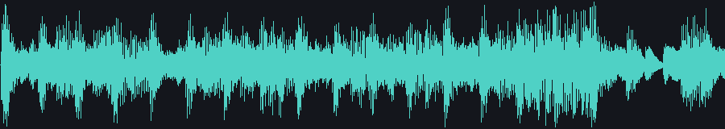

Nds4j
=====

[](https://central.sonatype.com/artifact/io.github.turtleisaac/Nds4j/)
[](https://javadoc.io/doc/io.github.turtleisaac/Nds4j)
[](https://www.gnu.org/licenses/gpl-3.0)

**Nds4j** is a <u>**WIP**</u> Java library that can help you read, modify and create a few types of files used in
Nintendo DS games, with many more coming soon.

*Note:* DSi-enhanced ROMs round-trip byte-exact when unedited; editing one and saving doesn't yet recompute
the DSi digest/signature, so an edited DSi ROM may not pass the console's integrity check.

> Author: Turtleisaac

This project started off as a replacement for a few Java packages which are still used by Java tool developers in the Pokémon
DS hacking community (aka pretty much only me), namely [jNdstool](https://github.com/JackHack96/jNdstool) by
[JackHack96](https://github.com/JackHack96) and [Narctowl](https://github.com/turtleisaac/Narctowl) by myself. Part of the
codebase uses [ndspy](https://github.com/RoadrunnerWMC/ndspy/tree/master)
by [RoadrunnerWMC](https://github.com/RoadrunnerWMC) as a reference and can be thought of as a Java counterpart to it.

Nds4j is suitable for use in applications written in Java or any other language which runs on the JVM.
As Nds4j is written in pure Java, it is cross-platform and should run on all platforms Java 8 or higher supports.
Note that Java doesn't support the Nintendo DS itself; Nds4j is intended to be used on your computer.

Special thanks to [red031000](https://github.com/red031000) for helping me figure some particularly annoying formats out.

Formats currently implemented
-----------------------------

| Format      | Corresponding Java Class                   | Reading | Writing | Full Editing Capability |
|:------------|:--------------------------------------------|:-------:|:-------:|:-----------------------:|
| NDS ROM     | `NintendoDsRom`                             | &check; | &check; |         &check;         |
| NARC        | `Narc`                                      | &check; | &check; |         &check;         |
| NCGR        | `images.IndexedImage`                       | &check; | &check; |         &check;         |
| NCLR        | `images.Palette`                            | &check; | &check; |         &check;         |
| NCER        | `images.CellBank`                           | &check; | &check; |         &check;         |
| NANR        | `images.CellAnimation`                      | &check; | &check; |         &check;         |
| NSCR        | `images.Screen`                             | &check; | &check; |         &check;         |
| NMCR        | `images.MultiCellBank`                      | &check; | &check; |         &check;         |
| NMAR        | `images.MultiCellAnimation`                 | &check; | &check; |         &check;         |
| NFTR        | `images.NitroFont`                          | &check; | &check; |         &cross;         |
| NSBMD       | `g3d.ModelSet` / `g3d.Model`                 | &check; | &check; |         &check;         |
| NSBTX       | `g3d.TextureSet`                             | &check; | &check; |         &check;         |
| NSBCA       | `g3d.SkeletalAnimationSet`                   | &check; | &check; |         &cross;         |
| NSBTA       | `g3d.TextureSrtAnimationSet`                 | &check; | &check; |         &check;         |
| NSBTP       | `g3d.TexturePatternAnimationSet`             | &check; | &check; |         &cross;         |
| NSBVA       | `g3d.VisibilityAnimationSet`                 | &check; | &check; |         &cross;         |
| NSBMA       | `g3d.MaterialColorAnimationSet`              | &check; | &check; |         &check;         |
| SPA / SPL   | `g3d.ParticleSet`                            | &check; | &check; |         &cross;         |
| Nitro LZ    | `framework.NitroLz` (LZ10/LZ11)              | &check; | &check; |         &check;         |
| Nitro Huffman | `framework.NitroHuffman` (4-bit/8-bit)     | &check; | &check; |         &check;         |
| BMG         | `text.BinaryMessage`                         | &check; | &check; |         &check;         |
| SDAT        | `sound.SoundArchive`                         | &check; | &check; |         &cross;         |
| SWAV / SWAR | `sound.Wave` / `sound.WaveArchive`           | &check; | &check; |         &cross;         |
| SBNK        | `sound.InstrumentBank`                       | &check; | &check; |         &cross;         |
| SSEQ / SSAR | `sound.Sequence` / `sound.SequenceArchive`   | &check; | &check; |         &cross;         |
| STRM        | `sound.Stream`                               | &check; | &check; |         &cross;         |
| Banner/Icon | `IconBanner`                                 | &check; | &check; |         &check;         |
| NTFT        | `images.RawTexture`                          | &check; | &check; |         &check;         |
| NTFP        | `images.RawPalette`                          | &check; | &check; |         &check;         |
| ARM9/ARM7   | `binaries.MainCodeFile`                      | &check; |         |                          |

All of the formats above round-trip byte-for-byte across the retail ROMs and were reverse-engineered
natively -- no third-party reader is wrapped or depended upon. A few highlights beyond the table:

* The 3D (`NSB*`) stack can **author** files from scratch (`g3d.ObjImporter`/`ModelBuilder`,
  `g3d.AnimationBuilder`), **export** to glTF 2.0 or OBJ, and **preview** them with a pure-Java software
  rasterizer (`g3d.SoftwareRenderer`) or a Swing viewer (`g3d.ModelViewer`) -- no native/OS-specific
  dependencies anywhere. `g3d.ImdImporter` even reproduces Nintendo's own `g3dcvtr` tool byte-for-byte.
* The 2D `images.*` formats support **write-back**: edit an assembled sprite or background image and Nds4j
  decomposes it back into its source tileset/cells/palette for you. `NMCR`/`NMAR`/`NFTR` are Gen V-only, so
  their fixtures come from White2 instead of the Gen IV Pok&eacute;mon ROMs.
* `sound.*` includes a pure-JVM software synthesizer (`sound.SequencePlayer`) that renders an
  SSEQ+SBNK+SWAR straight to PCM, plus WAV import/export.
* `text.BinaryMessage` (`BMG`) is Nintendo's cross-title GameCube/Wii/DS text container, ported from
  [ndspy](https://github.com/RoadrunnerWMC/ndspy) -- shows up in nearly every DS ROM checked so far,
  including the mainline Pok&eacute;mon games, not just the ones with a dedicated 3D/2D asset pipeline.
* `NTFT`/`NTFP` (`images.RawTexture`/`RawPalette`) are raw, headerless formats with no confirmed retail
  example anywhere until one turned up in *Learn with Pok&eacute;mon: Typing Adventure*.
* `framework.NitroLz` also handles a `"LZ77"`-tagged variant of the LZ10/LZ11 stream some titles wrap the
  ordinary stream in; `framework.NitroHuffman` covers the SDK's other built-in compression type.

Likely future supported formats
--------------------------------

These are sorted in order of their likely priority, but that order can and will change.

* RLE, the last of the Nitro SDK's built-in compression codecs (`NitroLz` covers LZ10/LZ11, `NitroHuffman`
  covers Huffman, `CodeCompression` covers the ARM-code BLZ variant)
* NTFI, the third member of the NTFT/NTFP raw-texture family -- no confirmed retail example yet, and its
  existence as a real, distinct format is unconfirmed
* A glTF *import* front-end for the 3D stack (export and OBJ import both already work)


A few examples of Nds4j in action
---------------------------------

```java
import Narc;
import NintendoDsRom;
import BinaryWriter;
import Endianness;
import MemBuf;
import javax.imageio.ImageIO;
import java.io.File;
import g3d.ModelSet;
import g3d.Model;
import g3d.GltfExporter;
import g3d.SoftwareRenderer;
import images.IndexedImage;
import images.Palette;
import images.CellBank;
import images.CellAnimation;
import sound.SoundArchive;
import sound.SoundArchive.RecordType;
import sound.SequencePlayer;
import sound.WavFile;

public class Example
{
    /**
     * Extract a file from inside of a provided ROM file and write it to disk
     */
    public static void example1(NintendoDsRom rom) throws java.io.IOException
    {
        BinaryWriter.writeFile("a012.narc", rom.getFileByName("a/0/1/2"));
    }

    /**
     * Modify the contents of a NARC in memory
     */
    public static void example2(NintendoDsRom rom)
    {
        Narc narc = new Narc(rom.getFileByName("a/0/5/6"));
        byte[] data = narc.getFile(0);
        //dataBuf.writer() can be used to write to a buffer in memory (aka dataBuf)
        // (conversely, dataBuf.reader() can be used to read from the same buffer)
        // (do keep in mind that you'll have to keep track of the end of the buffer yourself at times)
        MemBuf dataBuf = MemBuf.create();
        MemBuf.MemBufWriter writer = dataBuf.writer();
        writer.write(data);
        int end = writer.getPosition();
        writer.setPosition(0);
        writer.writeUInt32(0xFFFFFFFFL);
        writer.setPosition(end);
        narc.setFile(0, dataBuf.reader().getBuffer()); //puts the modified byte[] back into the narc
        rom.setFileByName("a/0/5/6", narc.save()); //generates a new byte[] representing the modified narc
    }

    /**
     * Unpack the entire ROM to disk (similar to how ndstool functions)
     */
    public static void example3(NintendoDsRom rom) throws java.io.IOException
    {
        rom.unpack("hg_unpacked"); //creates a folder named "hg_unpacked" in the current working directory
    }

    /**
     * Let's say you've modified the unpacked folder from example3 and want to load it back into Nds4j
     */
    public static void example4() throws java.io.IOException
    {
        NintendoDsRom rom = NintendoDsRom.fromUnpacked("hg_unpacked");
        rom.saveToFile("HeartGold_Modified_2.nds", false);
    }

    /**
     * Let's say you want to unpack a narc to disk (same functionality as knarc or Narctowl)
     * And of course after some edits, you can load it back in
     */
    public static void example5() throws java.io.IOException
    {
        NintendoDsRom rom = NintendoDsRom.fromFile("HeartGold.nds");
        Narc narc = new Narc(rom.getFileByName("a/0/5/6"));
        narc.unpack("a056_unpacked");

        // go use another tool or do whatever, but let's say now you want to pack it back to being a NARC

        Narc packed = Narc.fromUnpacked("a056_unpacked", true, Endianness.EndiannessType.BIG);

        // from here you can put it back into a ROM or whatever
    }

    /**
     * Export the ROM's own icon (the one shown on the DS home menu) as a PNG
     */
    public static void example6(NintendoDsRom rom) throws java.io.IOException
    {
        ImageIO.write(rom.getBanner().getIcon(), "png", new File("icon.png"));
    }

    /**
     * Load a 3D model (NSBMD) out of a NARC, export it as an OBJ and a glTF, and render a quick preview
     */
    public static void example7() throws java.io.IOException
    {
        NintendoDsRom platinum = NintendoDsRom.fromFile("Platinum.nds");
        Narc narc = new Narc(platinum.getFile(142)); // wherever your game keeps its models
        ModelSet models = new ModelSet(narc.getFile(51));
        Model model = models.getModels().get(0);

        BinaryWriter.writeFile("model.obj", model.toObj().getBytes());
        BinaryWriter.writeFile("model.gltf", GltfExporter.toGltf(model, models.getEmbeddedTextures()).getBytes());

        // a dependency-free preview -- no GPU/native renderer needed
        ImageIO.write(SoftwareRenderer.render(model, models.getEmbeddedTextures(), 400, 400, 200, -5),
                "png", new File("model_preview.png"));
    }

    /**
     * Assemble a sprite from its NCGR/NCLR/NCER/NANR stack and export one animation frame as a PNG.
     * Each 2D format layers on the one before it: NCGR is the raw tile pixels, NCLR colors them, NCER
     * composes tiles into a cell (a single pose), and NANR animates a sequence of cells.
     */
    public static void example8(NintendoDsRom rom) throws java.io.IOException
    {
        Narc narc = new Narc(rom.getFile(174)); // wherever your game keeps its character sprites

        IndexedImage ncgr = new IndexedImage(narc.getFile(0), 0, 0, 1, 1, true);
        ncgr.setPalette(new Palette(narc.getFile(1), 0));

        CellBank ncer = new CellBank(narc.getFile(5));
        ncer.setParentImage(ncgr); // NCER cells are drawn from the NCGR's tiles

        CellAnimation nanr = new CellAnimation(narc.getFile(4));
        nanr.setCellBank(ncer); // NANR frames animate the NCER's cells

        CellAnimation.Animation.Frame firstFrame = nanr.getAnimations()[0].getFrames()[0];
        ImageIO.write(nanr.getFrameImage(firstFrame), "png", new File("sprite_frame.png"));
    }

    /**
     * Find a game's SDAT, render one of its sequences (SSEQ, through its SBNK instrument bank and SWAR
     * waveforms) straight to PCM with the built-in software synthesizer, and export it as a WAV
     */
    public static void example9(NintendoDsRom rom) throws java.io.IOException
    {
        SoundArchive sdat = null;
        for (int i = 0; i < rom.getNumFiles() && sdat == null; i++)
        {
            byte[] f = rom.getFile(i);
            if (f != null && f.length >= 4 && new String(f, 0, 4).equals("SDAT"))
                sdat = SoundArchive.fromBytes(f);
        }

        SequencePlayer player = SequencePlayer.forSequence(sdat, 1008); // SEQ_GS_POKEMON_THEME, HeartGold
        short[] pcm = player.renderStereo(32000, 8.0); // interleaved L,R, capped at 8 seconds
        BinaryWriter.writeFile("theme.wav", WavFile.pcm16(pcm, 2, 32000));
    }

    /**
     * Paint on an assembled cell image and write the edit back down through the NCER into the NCGR's
     * tiles -- the same write-back path an image editor's "save" would drive
     */
    public static void example10() throws java.io.IOException
    {
        NintendoDsRom rom = NintendoDsRom.fromFile("HeartGold.nds");
        Narc narc = new Narc(rom.getFile(174));

        IndexedImage ncgr = new IndexedImage(narc.getFile(0), 0, 0, 1, 1, true);
        Palette palette = new Palette(narc.getFile(1), 0);
        ncgr.setPalette(palette);

        CellBank ncer = new CellBank(narc.getFile(5));
        ncer.setParentImage(ncgr);

        java.awt.image.BufferedImage cellImage = ncer.getNcerImage(0); // the assembled pose
        java.awt.Graphics2D g = cellImage.createGraphics();
        g.setColor(java.awt.Color.BLUE);
        g.fillRect(cellImage.getWidth() / 2 - 6, 2, 12, 12); // paint a patch on the hat
        g.dispose();

        // decomposes the edited image back into the NCGR's tiles, colors matched against the palette
        ncer.applyImage(0, cellImage, ncgr, palette);
        BinaryWriter.writeFile("edited.ncgr", ncgr.save()); // the edit now lives in the NCGR file itself
    }


    public static void main(String[] args) throws java.io.IOException
    {
        NintendoDsRom rom = NintendoDsRom.fromFile("HeartGold.nds");
        example1(rom);
        example2(rom);
        example3(rom);
        // the false makes it so it does not update the device capacity byte in the ROM header
        rom.saveToFile("HeartGold_Modified.nds", false);

        example4();
        example5();
        example6(rom);
        example7();
        example8(rom);
        example9(rom);
        example10();
    }
}
```

What a few of those examples actually produce (every image below came out of the code above, unedited):

| | | |
|:---:|:---:|:---:|
| <br>`example6` &mdash; the ROM's own icon | <br>`example7` &mdash; an NSBMD, rendered | <br>`example8` &mdash; NCGR+NCLR+NCER+NANR, assembled |
| <br>`example9` &mdash; an SSEQ, rendered to PCM (waveform shown; it's actually audio) |  <br>`example10` &mdash; before/after the write-back edit | |


Misconceptions
--------------

Still a little confused about what exactly Nds4j is or what it's capable of?
This section will try to answer some questions you may have.

- Nds4j is a *library*, not a *program.* To use Nds4j, you have to write your
    own Java code; Nds4j is essentially a tool your code can use. This may
    sound daunting -- especially if you're not very familiar with Java -- but
    if Python is what you are more familiar with, please check out
    [ndspy](https://github.com/RoadrunnerWMC/ndspy/tree/master) <sup>**_(feature parity is not guaranteed)_**</sup>.
- Nds4j runs on your PC, not on the Nintendo DS itself. You use it to create
    and modify game files, which can then be run on the console. DS games have
    to be written in a compiled language such as C or C++ to have any hope of
    being efficient; Nds4j will never be a serious option there,
    unfortunately.
- Nds4j doesn't support every type of file used in every DS game. In fact,
    for any given game, it's likely that the majority of the game's files
    *won't* be supported by Nds4j. There's a huge amount of variety in video
    game file formats, and it would be impossible to support them all. Nds4j
    focuses on file formats used in many games, especially first-party ones.
    Support for formats that are specific to a particular game would best
    belong in a separate Java package instead.

    That said, certain parts of Nds4j (such as its support for ROM files and
    raw texture data) have to do with the console's hardware rather than its
    software, and thus should be relevant to most or all games.

    Additionally, classes within Nds4j such as `Buffer`, `MemBuf`, `MemBuf.MemBufWriter`,
    `MemBuf.MemBufReader`, and `BinaryWriter` can all be used by projects which
    use Nds4j and can provide easy reading/writing of binary data to/from files.

Distribution
------------

Nds4j is published to Maven Central. Add it to a Maven project with:

```xml
<dependency>
    <groupId>io.github.turtleisaac</groupId>
    <artifactId>Nds4j</artifactId>
    <version>1.0.0</version>
</dependency>
```

or to a Gradle project with:

```groovy
implementation 'io.github.turtleisaac:Nds4j:1.0.0'
```

Every published version is listed on [the Maven Central artifact page](https://central.sonatype.com/artifact/io.github.turtleisaac/Nds4j),
and jars are also attached to the [Releases Page](https://github.com/turtleisaac/Nds4j/releases/latest) here on GitHub.

Documentation
-------------

[Nds4j's documentation is hosted on Javadoc.io](https://www.javadoc.io/doc/io.github.turtleisaac/Nds4j/latest/index.html)


Support
-------

If you think you've found a bug in Nds4j, please [file an issue on GitHub](https://github.com/turtleisaac/Nds4j/issues/new). Thanks!

Versioning
----------

Nds4j follows [semantic versioning](https://semver.org/) to the best of my
ability. If a tool claims to work with Nds4j 1.0.2, it should also work with
Nds4j 1.2.0, but not necessarily 2.0.0. (Please note that not all of those
version numbers actually exist!)

All releases prior to Nds4j 1.0.0 should be considered unstable, as the API can and will change.

Sources
-------

A comprehensive list of sources will be maintained [here](Sources.md).

Guidelines for contributing
---------------------------

If you plan on contributing to Nds4j, please ensure that your additions meet the following criteria:
* All public methods and constructors have well-written Javadoc comments
* Debug prints have been removed or at the very least commented out
* Formats which begin with the generic NTR header should always extend `framework.GenericNtrFile`. See existing classes for examples.
* The following classes in the `framework` package should be used for the following purposes and be consistent with existing code:
  * `MemBuf` - Reading and writing binary data one value at a time.
    * `MemBuf.MemBufReader` - Reading binary data one value at a time.
    * `MemBuf.MemBufWriter` - Writing binary data one value at a time.
  * `Buffer` - Reading entire binary data (bytes) from file. 
  * `BinaryWriter` - Writing out completed binary data (bytes) to file.
* A simple yet informative `toString()` method should be included in your classes where applicable.
* An in-depth and **thoroughly tested** `equals()` method should be included in your classes where applicable.
* Exceptions should be informative. That is, the message included in them should contain the nature of the exception (aka what caused it), and when applicable, the illegal value that triggered it. Use common sense, and make sure exceptions do not contain expletives.
* Any sources you used should be added to [Sources.md](Sources.md)
* Unit tests have been written and included in the path `src/test/java/` which mirrors the placement of your code in `src/main/java`.
  * Your unit tests should test everything which you think needs to be tested. The most important test in my opinion is making sure that when you convert your object back to a `byte[]` to save it, that `byte[]` should be fed back to the constructor for the class and tested for equality.
* Limit the member variables your classes include to only what is needed to represent the simplest form of the format while retaining all functionality.
  * For example, if the file format includes offsets of some data within the file and that offset is only needed for the purpose of reading the data, you should not store it in a member variable. That offset can easily be recalculated upon writing out the file and will only serve to make things more confusing if you keep it.
  * Any member variables which you want to expose to the user need to have accessor and mutator methods made available.
* Any method, member variable, or inner class which does not need to be made available to the user should either be private or protected, depending on whether other classes need to be able to access them.
* Eliminate redundancy.
  * For example, if you need to perform compression operations for DS formats, use `framework.NitroLz`/`framework.NitroHuffman`/`framework.CodeCompression`, don't write your own redundant solution. If there is something missing from the framework class, fix the existing class instead of making a new class.
  * If you have code which multiple of your classes share, don't rewrite it in each of your classes. Either put it in a protected inner class within one of your classes and import it into the other, or if the code is general enough to have other potential applications, put it in a class in the `framework` package.
* Please do your best to make your code readable to other people! 
